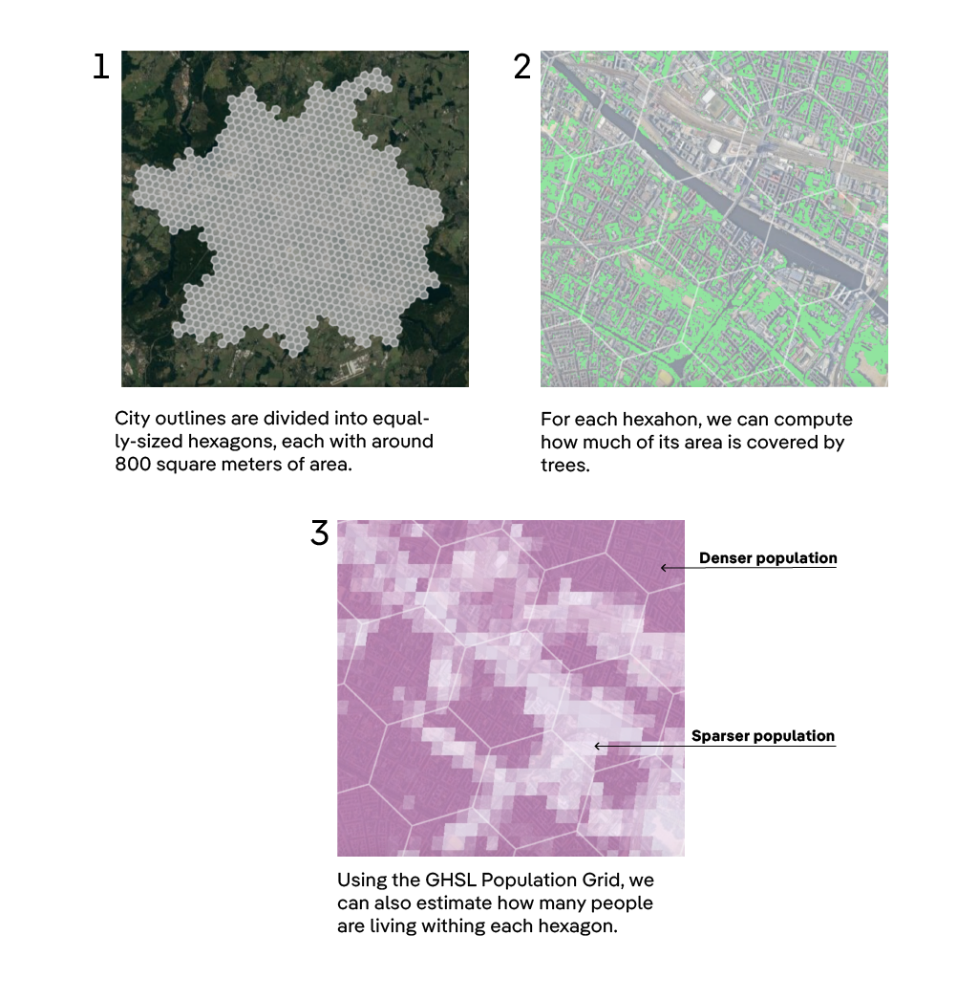

# Tree coverage in urban centers

This repository contains the source code and data behind the following DW story:

- [How green are Asia's cities?]((https://www.dw.com/en/how-green-are-asias-cities/a-70660037).

---

## Credits

**Development, data analysis, and visualization:** Rodrigo Menegat Schuinski
**Reporting and writing:** Emmy Sasipornkarn Srimingkwanchai
**Editing:** Anke Rasper, Gianna Grün, Rodion Ebbighausen, Wesley Rahn

---

## How was this made?

The methodology of the project is summarized below. 

At first, we present the data sources used. Then, we provide a high-level overview of the analysis.

For a detailed, step-by-step documentation, check the `code`directory containing the Jupyter Notebook files that power this project. Most of the development was done using Google Earth Engine and Python.

---

### 1. Data sources

#### 1.1 Tree coverage at a global scale

The project aims to compare tree coverage in cities spanning the whole globe, which creates methodological challenges. 

Environmental agencies, such as Europe’s EEA, often publish [reports on the subject](https://www.eea.europa.eu/data-and-maps/dashboards/urban-tree-cover). However, they are not available for all the cities we were interested in, and reports made by different local agencies are often not directly comparable.

Our solution was to use global satellite-based datasets to ensure a consistent measurement of tree cover across cities. 

The analysis relies in two datasets that use satellite imagery and machine learning to detect tree coverage throughout the Earth, focusing on trees taller than 1m.

Instead of providing aggregate metrics by city, they display which *points* of the planet are covered by trees or not, with metric precision. 

- The [first dataset](https://langnico.github.io/globalcanopyheight/) was published by researchers at ETH Zurich, University of Zurich, University of Copenhagen, and Yale University. It uses satellite images from 2020 and detects tree coverage with a 10m resolution – that is, detects whether a 10m square is covered by a tree or not.

- The [second dataset](https://sustainability.atmeta.com/blog/2024/04/22/using-artificial-intelligence-to-map-the-earths-forests/) was published by researchers at social media company Meta, in partnership with the World Resources Institute. It uses a similar method, but has a finer 1m resolution that allows more accurate area estimation.

Both datsets sometimes display false positives.

For example, the first sometimes detected non-existing trees in water surfaces with waves. The second would detect them in high-density urban stretches such as slums.

To reduce the impact of this errors, we combined both datasets, considering only areas marked as covered by trees in both.

#### 1.2 City outlines

We avoided using official administrative divisions, as they often include swathes of rural or semi-rural land that could distort the results.

In northern Brazil, for example, sparsely populated cities have administrative rights over extensive chunks of forest. Similar situations occur in countries all over the globe. 

We instead used city boundaries determined by satellite observations in the [Urban Center Database (UDCB)](https://www.nature.com/articles/s41597-023-02691-1), published by researchers at Copernicus, the European Union satellite initiative.

The UCDB relies on satellite imagery and statistical modelling to estimate the population living in 1km² squares at any point of the Earth’s surface. Then, it classifies each of the squares into categories ranging from *“Very low density rural”* to *“Urban centre.”* 

A city is a grouping of all the adjacent squares that are considered urban centres. 

The image below summarizes the process using the region around Paris (France) as an example:

Notice how areas areas are grouped regardless of local administrative divisions. In this example, the city of Paris includes close-by communes such as Poissy and Versailles.

UCDB's cities can be thought of as “metropolitan regions”, comprising an entire area where there’s a continuously high density of buildings and people. 

These satellite-derived cities can even extend beyond national borders. That is the case of the cities of Ciudad Juarez and El Paso, in the Mexico-US border, and of Singapore City and Johor Bahru in the Singapore-Malaysia border.

#### 1.3 Population distribution

Additionaly, we also used satellite-derived population estimates from the [Globan Human Setllement Layer (GHSL)](https://human-settlement.emergency.copernicus.eu/), also by researchers at Copernicus.

The GHSL is part of the data workflow behind the UCDB's city outlines. It esitmates how many people live in each of the aformenetioned squares, but with a smaller size of 100m². It was used to estimate how many people were living in specific regions of each city, as detailed below.

---

### 2. Data analysis

The goal of the analysis was to identify "tree-friendly" cities. Initially, we considered simply computing which percentage of a city's territory was covered by trees. This, however, proved misleading. 

Some cities had a large low-density suburbs covered by many trees, while most of its inhabitants lived in higher-density neighborhoods with no greenery. They ended up with a high share of the territory covered by trees, but the metric wouldn't reflect the daily experience of most of its inhabitants.

To capture this nuance, we decided to measure  _how green are the areas in which more people live_. To do so, each city outline was divided in hexagons of the same size, with around 800m² each. Then, we computed the tree coverage and population estimates for each hexagon.

Using this method, we could detect how many people were living in areas with different levels of tree coverage. For example, in Dhaka (Bangladesh), a quarter of the population lives in hexagons with a tree coverage below 2%, while in Mumbai (India) most of the population lives in areas with over 10% tree coverage.

In some charts, when representing each city's overall tree coverage, we used the mode of the distribution – that is, the level of tree coverage where the highest proportion of a city's population resides. This modal tree coverage also guided the selection of satellite imagery and street-level pictures used in the article.

