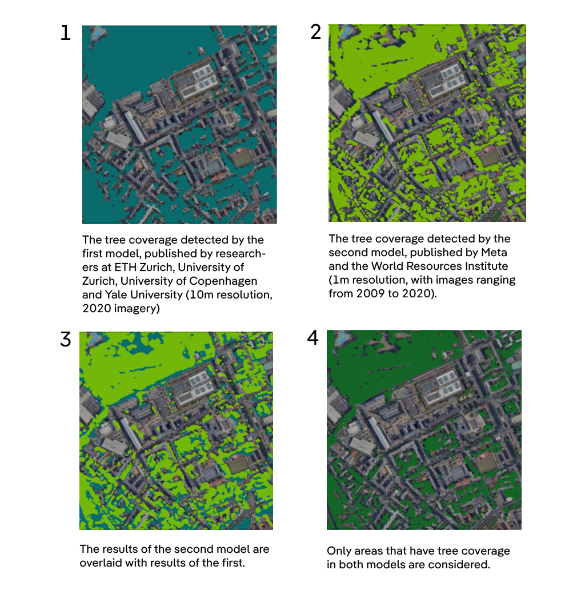

# Methodology write-up

# How was this made?

The methodology of the project is summarized below. 

At first, we present the data sources used, as well as how they were combined and cleaned. Then, we present how the data analysis was done, focusing on high-level conceptual explanations. 

For a more detailed, step-by-step documentation of what was done, check the `code` directory, where the source files that power the project are available – and, hopefully, thoroughly commented.

From a technical point of view, most of the development was done using Google Earth Engine and its Python bindings. We also used other Python packages, most importantly H3, pandas and geopandas.

Additionally, you can find any files and source code related to data visualization at the `viz` directory.

## 1. Data collection and preparation

Since its inception, the project aimed to compare the tree coverage in cities spanning the whole globe, which creates some methodological challenges. 

Environmental agencies, such as Europe’s EEA, often publish [reports on the subject](https://www.eea.europa.eu/data-and-maps/dashboards/urban-tree-cover). However, they were not available for all the cities we were interested in, and reports made by different local agencies are often not directly comparable.

One solution was to look for a measure of tree cover that would cover the whole globe, and that would allow for direct city comparisons, at least to some extent. The datasets selected, both for detecting tree coverage and city outlines, were preferred because of their global scope.

### 1.1 Tee coverage at a global scale

We used two datasets that use satellite imagery and machine learning techniques to detect tree coverage, as well as their canopy height, throughout the entire Earth. They were used to locate places which were covered by trees taller than 1m.

Instead of providing aggregate metrics by city (such as the [aforementioned EEA data](https://www.eea.europa.eu/data-and-maps/dashboards/urban-tree-cover)), they display which *points* of the planet are covered by a tree or not. In practice, we could know, with metric precision, where there was a tree.

The [first](https://langnico.github.io/globalcanopyheight/) was published by researchers at different universities: ETH Zurich, University of Zurich, University of Copenhagen and Yale University. It uses satellite images from 2020 to detect tree coverage with a resolution of 10m – that is, it allows us to know whether a 10m area has trees or not.

The [second](https://sustainability.atmeta.com/blog/2024/04/22/using-artificial-intelligence-to-map-the-earths-forests/) was published by researchers at social media company Meta, in partnership with the World Resources Institute. It uses a similar method, but is able to detect trees with an 1m resolution – a finer resolution that would allow a more precise area estimation, specially in cities, where vegetation tend to not be as dense. It uses satellite images from 2009 to 2020, depending on the region of the globe, with the majority coming from 2018 to 2020.

Upon manual inspection, we discovered that both were prone to have false some degree of false positives – that is, to detect trees in areas where there were not. 

For example, the first would often detect non-existing trees in water surfaces that were forming waves (like in Lagos, Nigeria). The second would detect them in high-density urban stretches, such as São Paulo and New Delhi. Those instances, though, were rare.

To reduce the risk of false positives, we decided to combine both of them. We chose only to keep the trees in second dataset that were also in a point marked as covered by trees in the first. This also allowed us to use the finer resolution for a more precise area measurement.

The image below illustrates the process:

### 1.2 City outlines

What are the limits of, say, Dhaka (Bangladesh)? Depending on the source, this might change a lot. According to the Bangladeshi government, its district spans even to the banks of the Padma river, kilometers south of the dense city center that most people associate with the name “Dhaka”.

Alternatively, the city of Buenos Aires, officially, only includes the area surrounded by the General Paz and 27 de Febrero avenues, home to 3 million people. It excludes the entire conurbated area surrounding it, which houses another 10 million people, and makes up what is known as the Greater Buenos Aires area.

To avoid such disparate definitions, which often depend more on the internal workings of local governments than on the people living there, we are using city boundaries derived from satellite observations.

They come from the Urban Center Database, published by researchers at Copernicus, the European Union satellite system. It relies on satellite imagery to estimate the population density on the ground, at any point of the Earth’s surface. Then, it connects all the observed areas that have a minimum of 1,500 inhabitants or a significant built-up area into “urban centers”. 

They cover entire extents of urban development, regardless of local administrative divisions. They can be thought of as “metropolitan areas”,  comprising the entire area where there’s a continuos high density of people or buildings.

### 1.3 Population data

## 2. Data analysis

### 2.1 Computing the tree coverage by city

### 2.2 Computing how many people live near trees in each city

