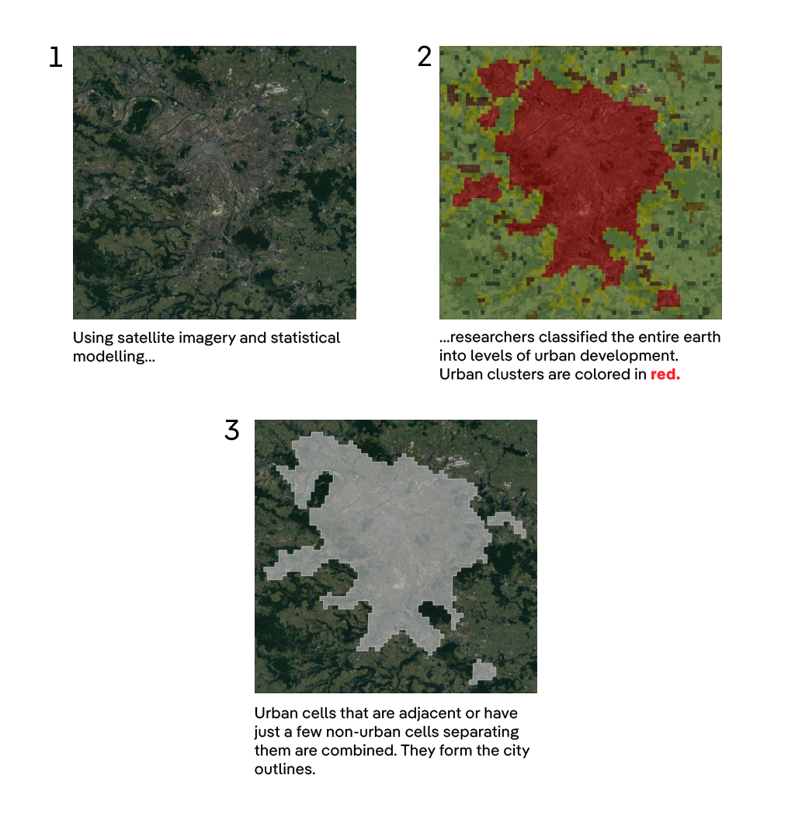

## How was this made?

The methodology of the project is summarized below. 

At first, we present the data sources used, as well as how they were combined and cleaned. Then, we present how the data analysis was done, focusing on high-level conceptual explanations. 

For a more detailed, step-by-step documentation of what was done, check the `code` directory, where the source files that power the project are available – and, hopefully, thoroughly commented.

From a technical point of view, most of the development was done using Google Earth Engine and its Python bindings. We also used other Python packages, most importantly H3, pandas and geopandas.

Additionally, you can find any files and source code related to data visualization at the `viz` directory.

### 1. Data collection and preparation

Since its inception, the project aimed to compare the tree coverage in cities spanning the whole globe, which creates some methodological challenges. 

Environmental agencies, such as Europe’s EEA, often publish [reports on the subject](https://www.eea.europa.eu/data-and-maps/dashboards/urban-tree-cover). However, they were not available for all the cities we were interested in, and reports made by different local agencies are often not directly comparable.

One solution was to look for a measure of tree cover that would cover the whole globe, and that would allow for direct city comparisons, at least to some extent. The datasets selected, both for detecting tree coverage and city outlines, were preferred because of their global scope.

#### 1.1 Tee coverage at a global scale

We used two datasets that use satellite imagery and machine learning techniques to detect tree coverage, as well as their canopy height, throughout the entire Earth. They were used to locate places which were covered by trees taller than 1m.

Instead of providing aggregate metrics by city (such as the [aforementioned EEA data](https://www.eea.europa.eu/data-and-maps/dashboards/urban-tree-cover)), they display which *points* of the planet are covered by a tree or not. In practice, we could know, with metric precision, where there was a tree.

The [first](https://langnico.github.io/globalcanopyheight/) was published by researchers at different universities: ETH Zurich, University of Zurich, University of Copenhagen and Yale University. It uses satellite images from 2020 to detect tree coverage with a resolution of 10m – that is, it allows us to know whether a 10m area has trees or not.

The [second](https://sustainability.atmeta.com/blog/2024/04/22/using-artificial-intelligence-to-map-the-earths-forests/) was published by researchers at social media company Meta, in partnership with the World Resources Institute. It uses a similar method, but is able to detect trees with an 1m resolution – a finer resolution that would allow a more precise area estimation, specially in cities, where vegetation tend to not be as dense. It uses satellite images from 2009 to 2020, depending on the region of the globe, with the majority coming from 2018 to 2020.

Upon manual inspection, we discovered that both were prone to have false some degree of false positives – that is, to detect trees in areas where there were not. 

For example, the first would often detect non-existing trees in water surfaces that were forming waves (like in Lagos, Nigeria). The second would detect them in high-density urban stretches, such as São Paulo and New Delhi. Those instances, though, were rare.

To reduce the risk of false positives, we decided to combine both of them. We chose only to keep the trees in second dataset that were also in a point marked as covered by trees in the first. This also allowed us to use the finer resolution for a more precise area measurement.

The image below illustrates the process:

#### 1.2 City outlines

After getting data for tree coverage spanning the entire world, we needed to do something similar for cities.

Since we wanted to compute, in the end, the total area covered by trees in each city, we couldn’t rely on official administrative divisions, as they often include swathes of rural or semi-rural land. 

Despite officially belonging to a municipality, those aren’t really urban areas, and could distort the results if the non-developed regions were too large – something which happens, for example, in Brazil, where sparsely populated cities have administrative rights over extensive chunks of forest.

Administrative division also don’t always reflect the experience of living in a city. 

For example, New York, in the United States, is officially divided into five different counties, despite being a single entity governed by one mayor. 

Similarly, according to the Bangladeshi government, the Dhaka district spans even to the sparsely populated banks of the Padma river, kilometers south of the dense city center that most people associate with the capital.

Alternatively, the city of Buenos Aires, officially, only includes the area surrounded by the General Paz and 27 de Febrero avenues, home to 3 million people. It excludes the large urban area surrounding it, which houses another 10 million people, and makes up what is known as the Greater Buenos Aires area.

Situations like this occur in countries all over the globe. To avoid such problems, we decided on using city boundaries that were determined by satellite observations as well. They came from the [Urban Center Database](https://www.nature.com/articles/s41597-023-02691-1), published by researchers at Copernicus, the European Union satellite system. 

It relies on satellite imagery and statistical modelling to estimate the population living on 1km² squares at any point of the Earth’s surface. Then, it classify each of this square into categories ranging from *“Very low density rural”* to *“Urban centre.”* A city is nothing more than a collection of all the adjacent squares that are considered urban, with some additional conditions of minimum population and built-up area.

Let’s look at an image example, showing the urban centers around Paris:

Notice how, in practice, this definition covers entire extents of urban development, regardless of local administrative divisions. They can be thought of as “metropolitan areas”,  comprising the entire area where there’s a continuously high density of people or buildings. For example, Paris would include even other close-by communes such as Poissy and Versailles.

They can even extend beyond national borders. That is the case of the cities of Ciudad Juarez and El Paso, in the Mexico-US border, for example. The same happens in the border between Singapore and Malaysia, where Singapore City and Johor Bahru make up a single urban stretch.

## 2. Data analysis

With the tree data and the city outlines defined, we could go into the data analysis. We decided to perform it in both levels: at first, calculating the tree coverage for entire cities; then, looking at the tree distribution within a single city and its relation with population density.

### 2.1 Computing the tree coverage by city

The first step was straightforward. We simply computed the area taken by all trees that exist within the city boundaries and divided it by the area of the city.

### 2.2 Computing how many people live near trees in each city

For the second step, though, we had to perform some extra tasks.

At first, we divided each city outline in hexagons of the same size, with an area of around 800m² each. Then, we computed the area covered by trees within each hexagon.

We also estimated how many people were living in each hexagon using another dataset by the Copernicus team: the [GHSL Population Grid](https://human-settlement.emergency.copernicus.eu/download.php?ds=pop), which uses satellite imagery in a similar fashion to the Urban Center Database mentioned above. Instead of creating city outlines, however, it estimates how many people live in 100m² squares covering the entire globe. By overlaying or hexagons and this population grid, we could also know how many were living on it.

With this information, we could compute how many people were living in hexagons with a certain range of tree coverage in any given city. For example, in Dhaka (Bangladesh), one quarter of the population lives in hexagons with a tree coverage below 2%.

